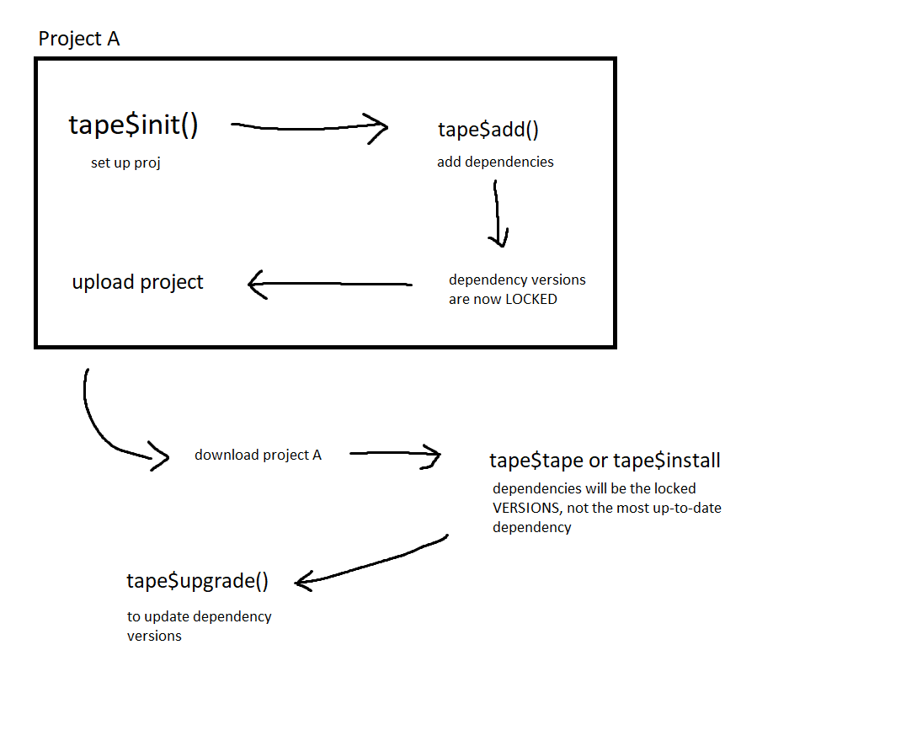

# Tape Module (WIP)
> You can't pack a [box::](https://github.com/klmr/box) without tape

Rudementary module manager in the vein of yarn and npm. Load via box::use(. / tape). An example use case can be seen below:

### Example 1
> 

# Files and Functions
### tape.json
A meta-data file similar to package.json or yarn.json. This holds the details of the current project, including used modules and packages.

### tape$init
Initialise tape.json and tape.lock files, and additionally creates tape directories.

``` r
box::use(. / modules / tape)
tape$init()
```

### tape$add
Add a module to your tape.json and install to module repo.

``` r
box::use(. / modules / tape)
tape$add(c('A/Repo','Another/Repo'))
```

### tape$remove
Remove a module from your tape.json file, and your _local_ module directory if applicable.

``` r
box::use(. / modules / tape)
tape$remove(c('A/Repo','Another/Repo'))
```

### tape$install
tape$install() downloads all the modules listed in the tape.json. Alternatively, tape$install('A/Repo') downloads a specified repository without adding to tape.json.

``` r
box::use(. / modules / tape)

tape$install()
# or
tape$install('A/Repo')
```

### tape$tape
Wrapper function that calls init() and then install(). Similar to running 'yarn' for any js users out there.

``` r
box::use(. / modules / tape)
tape$tape()
```

### tape$upgrade
tape$upgrade() checks all modules listed in tape.json for updates. Alternatively, tape$upgrade('A/Repo') updates a specified module.

``` r
box::use(. / modules / tape)

tape$upgrade()
# or
tape$upgrade('A/Repo')
```
